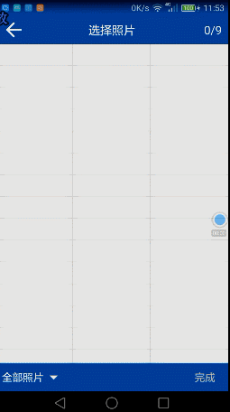

# ImageSelectorDemo
Androd ImageSelector Android图片选择器
 

####引用
```
```

####配置


####开始
```


ImageLoaderActivity.startActivityForResult(this, null);
 @Override
    protected void onActivityResult(int requestCode, int resultCode, Intent data) {
        if (requestCode == me.leefeng.imageselector.ImgSelConfig.REQUEST_CODE && data != null) {
            ArrayList<String> list = data.getStringArrayListExtra("array");
            String path = data.getStringExtra("path");
            if (list != null)
                Glide.with(this).load(list.get(0)).into(image);
            if (path != null) {
                Glide.with(this).load(path).into(image);
            }
        }
    }
``
