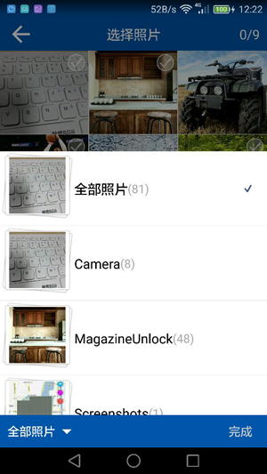

# ImageSelectorDemo
Androd ImageSelector Android图片选择器



 

####引用
```
compile 'me.leefeng:imageselector:1.0.6'
```

####配置
```
public class ImgSelConfig {
   public static int titleColor = Color.parseColor("#0056ac");//标题颜色
    public static int bottomBarColor = Color.parseColor("#0056ac");//底部背景颜色
    public static int titleHeight;//标题的高度 默认44dp
    public static Drawable titleBackImage;//标题返回键
    public static int maxNum = 9;//=0时只能选择一张图片，小于0时无限制选择，大于0时限制性选择个数
    public static int spanCount = 3;//列数

    public static ImageLoadMethod loadMethod;//默认是Glide图片，
    public static boolean isStateTran=true;//是否状态栏沉浸
    public static boolean showImageName;//是否显示图片的名称
  }
```


####开始
```
<!--开启-->
    ImageLoaderActivity.startActivityForResult(this, null);
<!--回显-->
    @Override
    protected void onActivityResult(int requestCode, int resultCode, Intent data) {
        if (requestCode == me.leefeng.imageselector.ImgSelConfig.REQUEST_CODE && data != null) {
            ArrayList<String> list = data.getStringArrayListExtra("array");
            String path = data.getStringExtra("path");
            if (list != null)
                Glide.with(this).load(list.get(0)).into(image);
            if (path != null) {
                Glide.with(this).load(path).into(image);
            }
        }
    }
``
